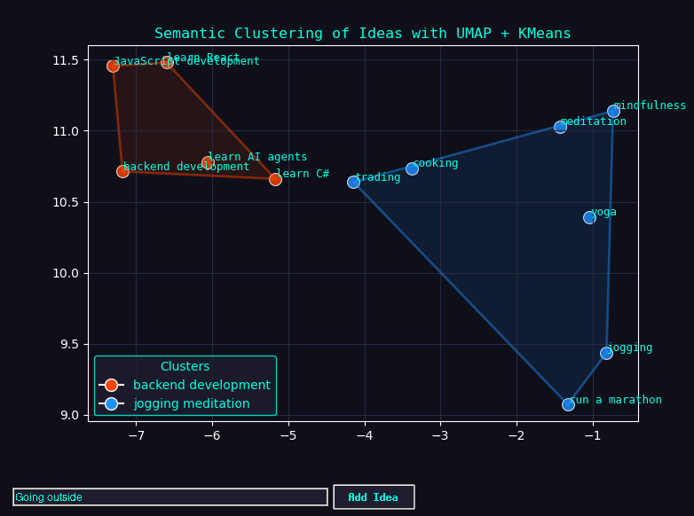

# Clusterly - Semantic Idea Mapper

Often we have many thoughts about what things we need to do now.
Especially, when it's weekend and we wish to be productive.
However, we often struggle to pick the most prioritized tasks,
that will make us enjoy and thrive at the same time.

Clusterly will help you to automatically organize your thoughts in the vector space,
group, band and label the groups using NLP techniques.

## The process

1. **Preprocessing** (lemmatization and normalization)
2. **Embedding** - `all-MiniLM-L6-v2` model
3. **Non-linear Dimensionality Reduction** - UMAP
4. **Clustering** - KMeans
5. **Labeling clusters** - KeyBERT

